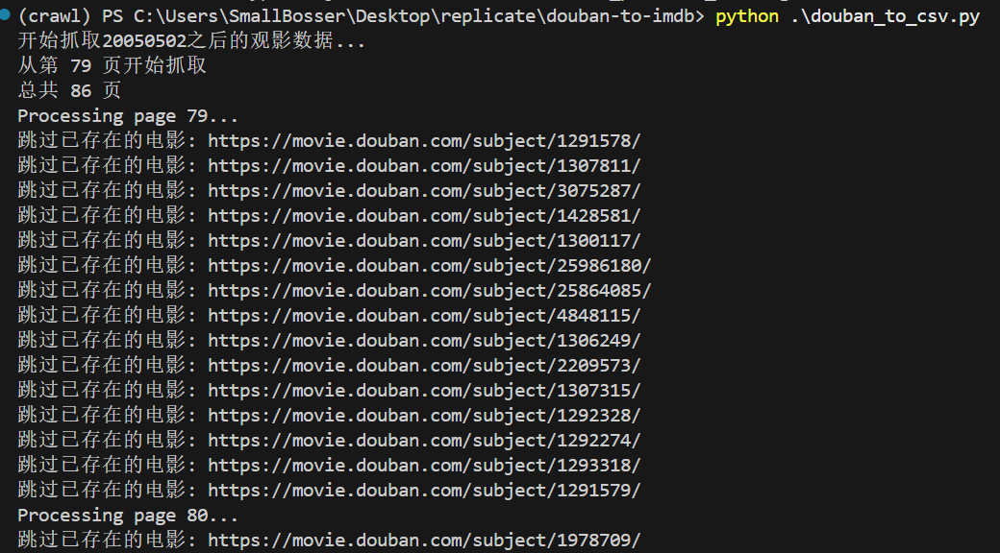
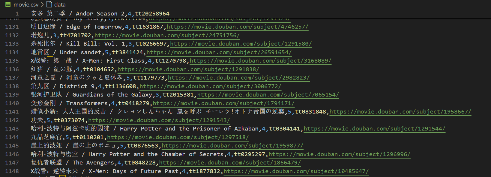
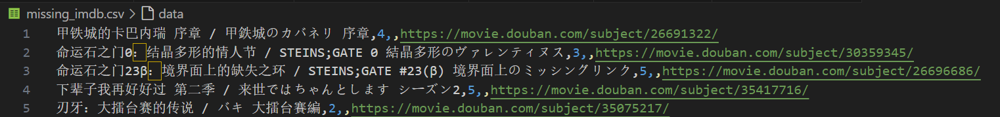
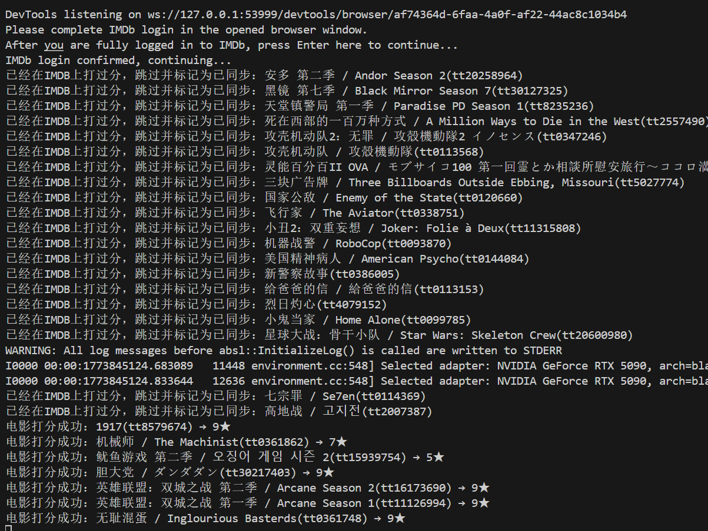

# douban-to-imdb-enhanced

[中文说明](README.md)

Export Douban movie ratings to CSV, then sync them to IMDb with Selenium.

This repository is adapted from [f-is-h/douban-to-imdb](https://github.com/f-is-h/douban-to-imdb). The documentation below reflects the current code in this repository.

## Workflow

The whole process has two steps, and the order matters:

1. Run `douban_to_csv.py` to export ratings from Douban into local CSV files
2. Run `csv_to_imdb.py` to read the CSV file and sync the ratings to IMDb

## Requirements

- Windows
- Python 3.8 or a nearby version
- Google Chrome
- A `chromedriver.exe` version that matches your local Chrome version

## Install Dependencies

Using `venv`:

```powershell
python -m venv .venv
.\.venv\Scripts\activate
pip install -r requirements.txt
```

Using conda:

```powershell
conda create -n douban-to-imdb-enhanced python=3.8 -y
conda activate douban-to-imdb-enhanced
pip install -r requirements.txt
```

Notes:

- See `requirements.txt` for the current dependency list
- This project uses `selenium==3.141.0`, which should be paired with `urllib3<2`

## Configuration

The current code reads local settings from `config.yaml`.

First, copy the example config:

```powershell
Copy-Item .\config.example.yaml .\config.yaml
```

Then edit `config.yaml` for your own environment:

```yaml
DOUBAN_COOKIES:
  bid: "your_bid"
  dbcl2: "your_dbcl2"
  ck: "your_ck"

user_id: "your_douban_user_id"
start_page: 0
START_DATE: "20240101"
MOVIE_CSV_FILE: "movie.csv"
MISSING_IMDB_CSV_FILE: "missing_imdb.csv"
CHROMEDRIVER_PATH: "E:\\chromedriver\\chromedriver-win64\\chromedriver.exe"
```

Field meanings:

- `DOUBAN_COOKIES`: your Douban login cookies, used to make scraping more stable
- `user_id`: your Douban user ID
- `start_page`: which page to start from; use `0` for the first page
- `START_DATE`: stop condition for scraping, in `yyyymmdd` format
- `MOVIE_CSV_FILE`: the main exported CSV filename
- `MISSING_IMDB_CSV_FILE`: the CSV filename for records without a valid IMDb ID
- `CHROMEDRIVER_PATH`: path to your local `chromedriver.exe`; if `chromedriver` is already available in your system `PATH`, you can leave this unset

## Privacy and Public Repositories

These files should normally stay local only:

- `config.yaml`
- `movie.csv`
- `missing_imdb.csv`

These files are already ignored by `.gitignore`. If you make the repository public, commit `config.example.yaml` instead of your real config and real data files.

## Step 1: Export Ratings from Douban

### How to Run

Use the default values from `config.yaml`:

```powershell
python .\douban_to_csv.py
```

You can also override values from the command line:

```powershell
python .\douban_to_csv.py <user_id> [yyyymmdd] [start_page]
```

Example:

```powershell
python .\douban_to_csv.py 172989509 20240101 17
```

Terminal example while exporting:



### Parameters

- `user_id`: if omitted, the script uses `user_id` from `config.yaml`
- `yyyymmdd`: if omitted, the script uses `START_DATE` from `config.yaml`
- `start_page`: if omitted, the script uses `start_page` from `config.yaml`

### How `START_DATE` Works

`START_DATE` uses the `yyyymmdd` format, for example:

```text
20240101
```

The script behaves like this:

- It only continues processing records whose rating date is later than `START_DATE`
- Once it encounters a record whose rating date is earlier than or equal to `START_DATE`, it stops going through later pages

### Export Logic

Compared with older versions of the README, the current `douban_to_csv.py` behaves differently in a few key ways:

- All settings are now loaded from `config.yaml` instead of being edited directly in the script
- Existing `douban_link` values already present in `movie.csv` are skipped automatically
- Missing or invalid IMDb IDs are written into `missing_imdb.csv`
- Both CSV files are written incrementally, and each row is followed by `flush` and `fsync`
- Items without a link, title, or valid rating date are skipped directly

### Output Files

`movie.csv`:

- Stores records that already have a valid IMDb ID
- Each row is roughly: `title, douban_rating, imdb_id, douban_link`



`missing_imdb.csv`:

- Stores records that have no IMDb ID or have an invalid IMDb ID
- It only deduplicates against itself and does not affect deduplication in `movie.csv`



## Step 2: Sync Ratings to IMDb

### Before You Run

Before running `csv_to_imdb.py`, make sure:

1. You have already run `douban_to_csv.py`
2. The CSV file pointed to by `MOVIE_CSV_FILE` has been generated
3. Chrome is installed
4. ChromeDriver matches your local Chrome version
5. `CHROMEDRIVER_PATH` works, or `chromedriver` is already available in your system `PATH`

### ChromeDriver

The current code supports two ways to launch ChromeDriver:

- Configure `CHROMEDRIVER_PATH` in `config.yaml`
- Leave the path unset and rely on `chromedriver` being available in your system environment

### Login Flow

The script will:

1. Open the IMDb sign-in page
2. Wait for you to finish logging in manually in the browser
3. Automatically detect whether login has completed successfully
4. Navigate back to the IMDb homepage and confirm the search box is available
5. Start syncing ratings one by one


Recommended:

- `Sign in with IMDb`

Not recommended:

- `Sign in with Google`

This is because Google sign-in is more likely to trigger extra security checks in a Selenium-controlled browser.

### Commands

Import ratings with the default offset:

```powershell
python .\csv_to_imdb.py
```

Remove existing IMDb ratings:

```powershell
python .\csv_to_imdb.py unmark
```

Use a custom rating offset:

```powershell
python .\csv_to_imdb.py -2
python .\csv_to_imdb.py -1
python .\csv_to_imdb.py 0
python .\csv_to_imdb.py 1
python .\csv_to_imdb.py 2
```

Terminal example while IMDb sync is running:



Notes:

- The allowed offset range is only `-2` to `2`
- The default offset is `-1`
- While the script is running, you can keep using your computer for other tasks, including during the IMDb automation phase
- You generally do not need to keep watching the browser window; for better stability, avoid manually interacting with the IMDb window that is currently being controlled by automation

### Rating Conversion

The script converts ratings using this rule:

```text
IMDb rating = Douban stars * 2 + offset
```

With the default settings:

- Douban 5 stars -> IMDb 9
- Douban 1 star -> IMDb 1

### CSV Changes After Sync

After a successful import, the script writes back to `movie.csv`:

- If a row originally has only 4 columns, a fifth column with value `1` is appended
- If a row already has a fifth column, it is updated to `1`

This marker means that the record has already gone through a successful rating write once.

## FAQ

### Why must I run `douban_to_csv.py` first?

Because `csv_to_imdb.py` reads the local file specified by `MOVIE_CSV_FILE`. Without that file, the second step has no input.

### Why can the export resume after interruption?

Because the export script writes incrementally:

- It writes to the CSV immediately after each processed record
- Any `douban_link` already written to `movie.csv` will be skipped in the next run

So if the process is interrupted, you do not need to start over from the beginning.

### Why do some items not end up in `movie.csv`?

Common reasons include:

- The Douban item page does not have an IMDb ID
- Access to the Douban page is restricted
- The parsed IMDb ID format is invalid
- The item is missing a title, link, or valid rating date

These records are skipped or written to `missing_imdb.csv`.

### Does `missing_imdb.csv` affect deduplication in `movie.csv`?

No.

The current logic is:

- `movie.csv` only deduplicates against `movie.csv`
- `missing_imdb.csv` only deduplicates against `missing_imdb.csv`

They do not affect each other.

### How can I recover faster if I need to rerun after being rate-limited or interrupted?

You can use both of these:

- Keep the existing `movie.csv`
- Adjust `start_page` so the script resumes from a later page

This lets you reuse the existing CSV for automatic skipping while also reducing repeated requests to earlier pages.

## Optional Next Step

If you want to continue importing your IMDb records into Trakt, you can also look at:

- [TraktRater](https://github.com/damienhaynes/TraktRater/releases)

## Credits

- This repository is based on [f-is-h/douban-to-imdb](https://github.com/f-is-h/douban-to-imdb)
- The Douban export logic references [douban-exporter-lite](https://github.com/IvanWoo/douban-exporter-lite)
- For Trakt import, you can also refer to [TraktRater](https://github.com/damienhaynes/TraktRater/releases)
